# 🗺️ Mapa de Telas e Fluxo de Dados (Questor Explorer / Vulcano)

> [!NOTE]
> **Documento Vivo:** Este fluxo e as regras abaixo serão atualizados ativamente a cada proposição de modificação arquitetural. Você pode analisar as mudanças aqui **antes de aprová-las**.

## 📊 Arquitetura de Dados e Componentes

Abaixo encontra-se o diagrama de conexão entre os visores do Frontend (Cortex) e nossas instâncias do Backend (Python) alimentadas pelos 3 bancos de dados vitais.

```mermaid
flowchart TD
    %% Cores e Estilos
    classDef frontend fill:#ff4d00,stroke:#222,stroke-width:2px,color:#000,font-weight:bold;
    classDef backend fill:#222,stroke:#ff4d00,stroke-width:2px,color:#fff;
    classDef questor fill:#0033cc,stroke:#000,stroke-width:2px,color:#fff,font-weight:bold;
    classDef vulcano fill:#b30000,stroke:#000,stroke-width:2px,color:#fff,font-weight:bold;
    classDef propria fill:#339933,stroke:#000,stroke-width:2px,color:#fff;

    %% Bancos de Dados
    subgraph Databases[Bancos de Dados Origem]
        Q[(Questor FDB)]:::questor
        V[(Vulcano FDB)]:::vulcano
        S[(SQLite Próprio)]:::propria
    end

    %% Backend
    subgraph Back[Motor Backend Python API]
        API[API Gateway Router]:::backend
        LLM[LLM Gemini e Ollama Extraction]:::backend
    end

    %% Frontend Telas
    subgraph Front[Telas de Visualizacao Cortex]
        T1([1. Empreendimentos]):::frontend
        T2([2. Fechamento Custos e POC]):::frontend
        T3([3. Sero INSS e Curva S]):::frontend
        T4([4. Vendas e Recebimentos]):::frontend
        T5([5. Smart Importer e PDF]):::frontend
        T6([6. Raw Explorer]):::frontend
        T7([7. Contabilizações]):::frontend
    end

    %% Roteamentos
    Q <--> |Driver firebirdsql| API
    V <--> |Driver firebirdsql| API
    S <--> |Driver sqlite3| API
    
    API <--> LLM
    
    API <--> |JSON / REST| T1
    API <--> |JSON / REST| T2
    API <--> |JSON / REST| T3
    API <--> |JSON / REST| T4
    API <--> |JSON / REST| T5
    API <--> |JSON / REST| T6
    API <--> |JSON / REST| T7

    %% Vínculos de Negócio
    T1 -.->|Cadastra/Espelha| V
    T1 -.->|Planos de Contas| Q
    
    T2 -.->|Puxa Gastos LCTOGER| Q
    T2 -.->|Evolução de Obra| S
    T2 -.->|Guarda Custo e Venda| V
    
    T3 -.->|Verifica Folha de Pagto| Q
    T3 -.->|Metragens p/ CUB| V
    
    T5 -.->|Converte PDF p/ JSON| LLM
```

---

## 🔍 Detalhamento por Tela (Lógicas e Bases Envolvidas)

### 1. 🏢 Empreendimentos (Cadastro e Mapeamento)
*   **Fonte Vulcano:** Tabelas `EMPREENDIMENTO`, `BLOCO`, `UNIDADE`. Onde ficam salvos os metadados da obra (Código CNO, Área Total, Início/Fim).
*   **Fonte Base Própria:** Banco de Dados SQLite `poc_database.sqlite` (Mapeamentos locais temporários).
*   **Fonte Base Questor:** Consulta de `PLANOGRUPOEMPRESACONTAS` para vincular as contas contábeis de Custo, Custos Ocorridos (Estoque) e Receita por empreendimento.

### 2. 🧮 Fechamento de Custos (Cálculo do POC)
*   **Fonte Vulcano:** 
    *   `POC_CUSTOS`, `POC_CUSTO_MENSAL_REAL` (Guarda os custos realizados).
    *   `VENDA`, `VENDAUNIDADE` (Calcula a fração da obra já comercializada).
*   **Fonte Base Própria (SQLite):** `evolucao_obras` (Histórico de percentual físico medido de uma obra).
*   **Fonte Base Questor:** `LCTOGER`, `LCTOCTB` (Agregação de lançamentos realizados nos Centros de Custo vinculados na aba Empreendimentos).
*   **Fórmulas Utilizadas:**
    `Fração Vendida = Área Vendida / Área Total (m²)`
    `Custo Acumulado = Gasto Real da Obra * Fração Vendida * (Percentual POC / 100)`

### 3. 🛡️ SERO INSS (Compliance de Construção) 
*   **Fonte Vulcano (CUB):** Tabela `INDICE_REAJUSTE_TABELA` (ID_INDICE = 1) e Agente Crawler autônomo `cub_agent.py` que raspa dados oficiais do Sinduscon a cada mês. Falhas de meses nulos são contornadas via CUB padrão codificado dinamicamente.
*   **Fonte Base Questor (Folha Real Rateada):** Cruzamento das tabelas de folha de pagamento `CALCULORATEIO` + `PERIODOCALCULO`.
    * Acesso restrito através do filtro exato: `CODIGOEVENTO = 5041` (Remuneração da Mão de Obra e Total INSS).
    * Ligação robusta de CNOs: Extração de Titularidade na `OUTRAEMPRESA` e `OUTRAEMPEMP` comparando a Inscrição Federal (`INSCRFEDPROPRIET` - O CNPJ real do dono do CNO) e batendo diretamente com o `INSCRFEDERAL` da tabela `ESTAB`. Antigas tentativas de usar `CODIGOESTABPROPRIET` geraram falhas no SQL (-206) pois a coluna é ilusória na base atual.
*   **Fórmulas Utilizadas (Instrução Normativa p/ Residencial Multifamiliar):**
    `Base de Mão de Obra Mensal Prevista = (Área Total * CUB Mensal da Competência) * 20% / 48 Meses`
    `Base Realçada (E-Social) = Soma do Evento 5041 mês a mês (Questor)`
    *A linha do gráfico compara as duas bases progressivamente ao longo da construção.*
    *Cálculo Final do Dashboard:* `INSS a Recolher = (Base Prevista Acumulada - Base Realçada Acumulada) * 36.8%`

### 4. 🛒 Vendas e Recebimentos (Comercial / CRM)
*   **Fonte Vulcano:** `VENDA`, `PESSOA`, `PARCELA`, `MENSALIDADE`.
*   **Fonte Base Questor:** `FATURAMENTO`, Livros Fiscais. 

### 5. 🤖 Smart Importer / Conversor Universal
*   **Fonte LLM / Base Própria:** Entidade `pdf_parser_templates`. Usa `pdfplumber` + Generative AI (Local qwen ou Gemini Flash) para devolver JSON estruturado a partir de PDF.
*   **Destino Final:** Salva em Vulcano (`POC_CUSTO_MENSAL_REAL`, `CONCILIACAO_BANCARIA`).

### 6. 👁️ Raw Explorer / Tributos Globais
*   **Raw Explorer:** Envia uma `Raw Query SQL` via API para buscar as linhas brutas direto do Vulcano ou Questor, sem intermediários. Ideal para debugar.
*   **Módulo Tributos:** Lê bases brutas de Notas Fiscais diretamente do `Questor`.

### 7. 🧾 Contabilizações (Auditoria de Balancete e Lançamentos)
*   **Fonte Base Questor (Física):** Tabelas `LCTOCTB` para débitos/créditos efetivos com Histórico (`COMPLHIST`) e `LCTOGER` para isolar todo lançamento por Centro de Custo (`CODIGOCENTROCUSTO`), que equivale ao Empreendimento em questão. Todo o "Custo Incorrido/Gasto Mensal Real" é proveniente do extrato do LCTOGER deste núcleo.
*   **Fonte Base Vulcano (Virtual/Extracontábil):** A injeção simulada que espelha a vida real da Obra, particionada na **Regra da Fração Ideal** e no cruzamento vetorial Unidade-a-Unidade (`DESCUNIDIMOB`).
*   **Fórmulas Utilizadas (Motor Vetorial por Unidade Vendida):**
    *   `Receita Econômica (DRE): VGV Unitário * % POC recente.` Gera Direito a Receber (Débito Clientes) e auferi receita DRE (Crédito).
    *   `Custo Econômico (DRE): (Custo Global Incorrido Questor * Fração VGV Unidade) * % POC recente.` Baixa o Estoque e vira Custo Efetivo.
    *   `Recebimento Financeiro (Caixa):` Liquida a conta Clientes até o teto da Receita Econômica Acumulada. O caixa excedente cai compulsoriamente na trincheira do Passivo Real de **Adiantamentos**.
    *   `Tributos Diferidos e Antecipados:` Particionamento tributário (IRPJ, CSLL, PIS, COFINS, RET) guiado exatamente pelo descompasso gerado entre a "Receita Econômica" (DRE) e a base financeira faturada em boletos (Caixa).
*   **Painel Frontend:** Grid estilo mestre-detalhe expansível, permitindo que o Analista Contábil navegue numa Conta Global (Ex: Conta Clientes) e extraia um detalhamento cirúrgico do avanço e repasse de Caixa de cada Apartamento/Lote. Exportação massiva em XLSX habilitada.
