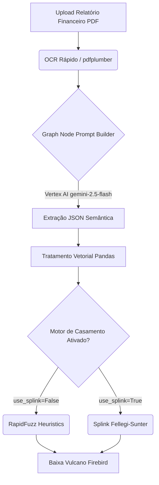

# Fluxo Neural e Heurístico de Conciliação
**V1.0 - Motor Inteligente de Absorção de Recebimentos**

Este documento detalha o *pipeline* da esteira do **Smart Importer** e do **Agente Investigativo**, partindo do momento em que um arquivo desestruturado (PDF de relatório de banco paralelo ou planilhas) é jogado no motor, passando pela limpeza com LLMs, vetorização no Pandas, até o casamento numérico (Record Linkage) nas bases legado (Firebird).

---

## 1. Topologia Visual do Fluxo (Mermaid / Canvas)

O núcleo do motor opera num funil híbrido (Híbrido de Redes Neurais e Lógica Simbólica). 



---

## 2. Fase Semântica: Extração LLM (Google Vertex AI)

Antes dos dados entrarem no banco relacional, precisamos extraí-los da forma desordenada criada em relatórios bancários paralelos (Ex: Sienge, planilhas da CEF). Esgotar RegEx se tornou insustentável.

**O Grafo de IA:**
1. **Leitura:** O endpoint `/api/smart-importer/upload` isola as páginas via PDFPlumber (usando `to_thread` assíncrono para rate-limiting).
2. **Engenharia de Prompt:** O código (em `main.py`) agrupa o texto extraído num Prompt "Rústico". Um `SCHEMA JSON` fixo e estrito é embutido numa f-string forçando chaves imutáveis: `comprador, cpf_cnpj, empreendimento, unidade, total_pago`.
3. **Vertex AI no Loop:** O `gemini-2.5-flash` roda sob *Cloud Run/Vertex Service Accounts*. Ao configurar `thinking_budget: 0` e usar MIME type `application/json`, exigimos que o motor responda instantaneamente sem rascunhos. O retorno é um JSON nativo com arrays bidimensionais.

---

## 3. Fase Vetorial: A Forja do Pandas

Após a IA extrair 50 a 3.000 linhas soltas do PDF, não subimos isso num longo e doloroso laço infinito (`for x in registros`). Isso engasgaria o Backend em requests densos de Firebird. Aqui entra a biblioteca `Pandas`.

**Fluxo Vetorial:**
- **Injeção de Memória Otimizada:** Criamos instâncias de `DataFrame` local.
- **Substituição Massiva:** Usamos `df.replace({np.nan: None})` em matriz global para trocar nulos quebrados por tipos compatíveis com o FastAPI e SQLite.
- **Normalização de Dimensões (Tempo):**
    ```python
    df['DATA_STR'] = pd.to_datetime(df['DATA']).dt.strftime('%d/%m/%Y')
    df['DATA_ISO'] = pd.to_datetime(df['DATA']).dt.strftime('%Y-%m-%d')
    ```
    Isso padroniza a interface e a busca reversa no backend. Todos os gráficos e tabelas reagem aos cast rápidos sem gargalo de formatação em runtime.

---

## 4. O Coração do Casamento: RapidFuzz e Splink (Record Linkage)

Aqui brilha o coração matemático da ferramenta! Com a planilha isolada, gerada na VRAM da IA (Vertex), ele puxa ***TODOS os contratos ativos*** do Legacy Engine (Vulcano Firebird) de uma só vez para o backend.

Agora, precisamos associar algo instável, por exemplo: Como o motor descobre que *Pedro Alves Monteiro (Apto 52)* importado de um PDF solto da Caixa Econômica Federal representa a baixa bancária da venda *ID 18* escondida na Tabela nativa `LCTOGER` ou `RECEBER` do Vulcano?

A flag `use_splink` (enviada pelo Frontend no Payload de Smart Importer) dita o comportamento:

### A. O Motor Heurístico: `RapidFuzz`
*(Condição: `use_splink=False`. Executa pontuação lógica baseada em Distância de Levenshtein).*
- O backend itera as extrações do PDF e as cruza contra toda a malha do Vulcano.
- Ele apela para a função **`token_set_ratio`**. Esta matemática **ignora a ordem** e as palavras irrelevantes/adicionais:
  - Comparação: `"JOAO CARLOS SILVA"` vs `"JOAO CARLOS DA SILVA"` = _Score de 95_.
- Ao parear o nome validado com o Fuzz Score (junto de filtros isoladores como Valores Pagos/Frações), se a variação for alta e ultrapassar **85%**, o motor consagra o *"Match Diamante"* (`"is_diamante": True`). Uma ligação definitiva para aquela parcela.

### B. O Motor Probabilístico Preditivo: `Splink`
*(Condição: Planilhas e ecossistemas gigantes onde homônimos ou CPFs estropiados explodem Falsos Positivos).*
- Invocamos o modelo **`Splink`** (uma engine da DuckDBAPI).
- Método Puramente Probabilístico: Usa o framework governamental/estatístico **Fellegi-Sunter**.
- Invés de comparar `"String de cima"` x `"String de Baixo"`, o Splink cria grafos matemáticos medindo "probabilidades" (`m-probability` vs `u-probability`). Exemplo prático do modelo: *(Qual a real probabilidade do nome "João" ser ele mesmo neste ecossistema de 3.000 clientes, versus a improbabilidade de existir dois CPFs "999" diferentes para o Condomínio "Stuttgart")*.
- Retorna uma precisão esmagadora (`prob -> 0.992`).

## 5. Próximo Passo: Conclusão do Grafo LangGraph

No ecossistema ideal futuro (que estamos construindo ativamente):
Os **Alertas do Agente (Human-in-the-Loop)** do Node de Grafo só pausarão o sistema na interface do Hub para a revisão final humana caso nem o Splink e nem o RapidFuzz ultrapassem o `threshold` seguro. Para todos os outros matchs "Diamantes", o Grafo desaguará instantaneamente e solitário no conector do Firebird, atualizando a "Auditoria" da conta `4910` sem depender de nenhum supervisor humano assinar embaixo.
